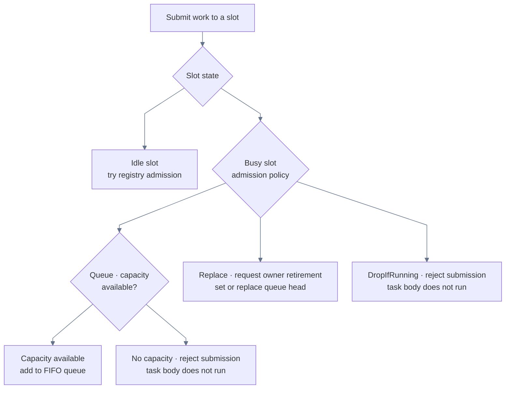

```mermaid
%%{init: {"theme": "default", "flowchart": {"curve": "linear", "htmlLabels": true, "nodeSpacing": 28, "rankSpacing": 28}, "themeVariables": {"primaryColor": "#eef2ff", "primaryTextColor": "#111827", "primaryBorderColor": "#7c3aed", "lineColor": "#64748b", "edgeLabelBackground": "#eef2ff", "secondaryColor": "#f8fafc", "tertiaryColor": "#ffffff", "fontFamily": "Arial", "fontSize": "15px"}}}%%
flowchart TB
    submit["Submit work to a slot"] --> state{"Slot state"}

    state --> idle["Idle slot<br/>try registry admission"]
    state --> policy{"Busy slot<br/>admission policy"}

    policy --> queue{"Queue · capacity<br/>available?"}
    policy --> replace["Replace&nbsp;·&nbsp;request&nbsp;owner&nbsp;retirement<br/>set&nbsp;or&nbsp;replace&nbsp;queue&nbsp;head"]
    policy --> drop["DropIfRunning&nbsp;·&nbsp;reject&nbsp;submission<br/>task&nbsp;body&nbsp;does&nbsp;not&nbsp;run"]

    queue --> enqueue["Capacity available<br/>add to FIFO queue"]
    queue --> full["No&nbsp;capacity&nbsp;·&nbsp;reject&nbsp;submission<br/>task&nbsp;body&nbsp;does&nbsp;not&nbsp;run"]
```
