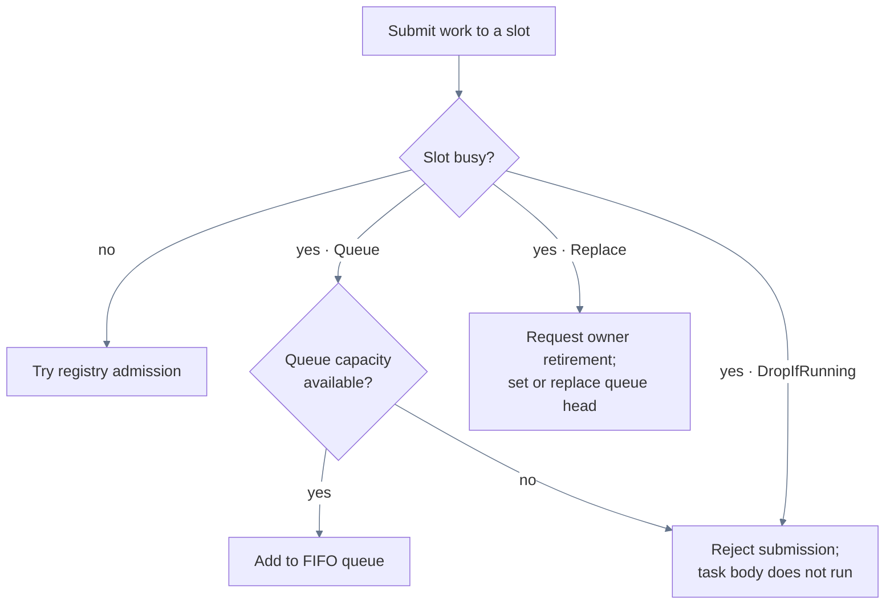

```mermaid
%%{init: {"theme": "default", "flowchart": {"curve": "basis", "htmlLabels": true}, "themeVariables": {"primaryColor": "#eef2ff", "primaryTextColor": "#111827", "primaryBorderColor": "#7c3aed", "lineColor": "#64748b", "edgeLabelBackground": "#ffffff", "secondaryColor": "#f8fafc", "tertiaryColor": "#ffffff", "fontFamily": "Arial", "fontSize": "18px"}}}%%
flowchart TD
    submit["Submit work to a slot"] --> busy{"Slot busy?"}
    busy -->|"no"| admit["Try registry admission"]
    busy -->|"yes · Queue"| capacity{"Queue capacity<br/>available?"}
    capacity -->|"yes"| queue["Add to FIFO queue"]
    capacity -->|"no"| reject["Reject submission;<br/>task body does not run"]
    busy -->|"yes · Replace"| replace["Request owner retirement;<br/>set or replace queue head"]
    busy -->|"yes · DropIfRunning"| reject
```
