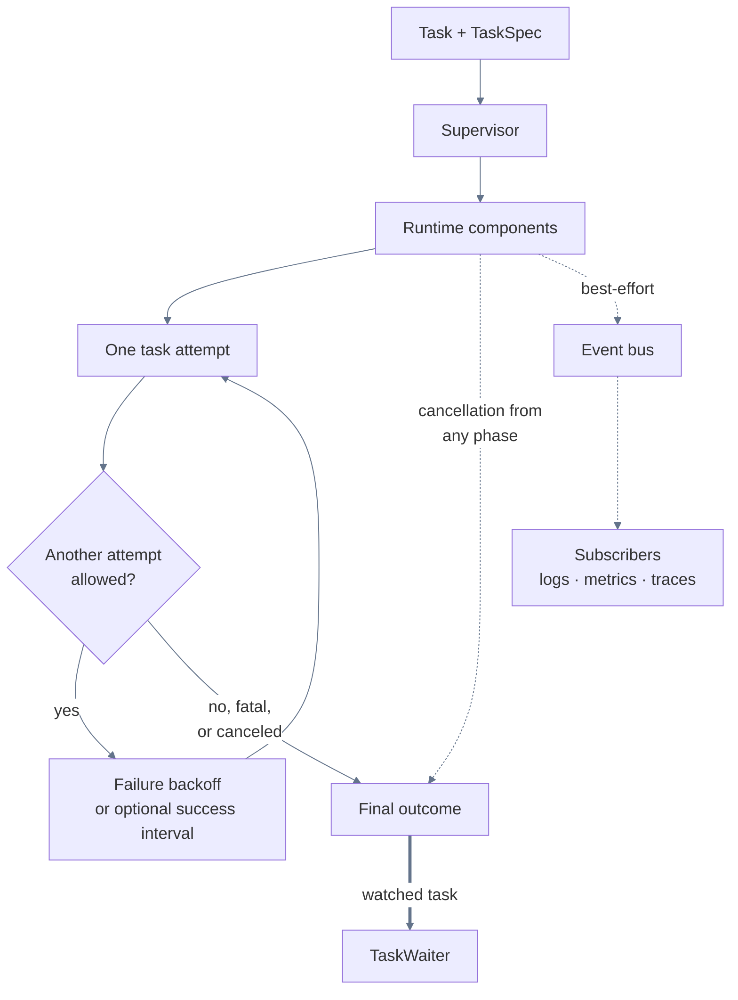

```mermaid
%%{init: {"theme": "default", "flowchart": {"curve": "basis", "htmlLabels": true}, "themeVariables": {"primaryColor": "#eef2ff", "primaryTextColor": "#111827", "primaryBorderColor": "#7c3aed", "lineColor": "#64748b", "edgeLabelBackground": "#ffffff", "secondaryColor": "#f8fafc", "tertiaryColor": "#ffffff", "fontFamily": "Arial", "fontSize": "18px"}}}%%
flowchart TD
    input["Task + TaskSpec"] --> supervisor["Supervisor"]
    supervisor --> runtime["Runtime components"]
    runtime --> attempt["One task attempt"]
    attempt --> decision{"Another attempt<br/>allowed?"}
    decision -->|"yes"| delay["Failure backoff<br/>or optional success interval"]
    delay --> attempt
    decision -->|"no, fatal,<br/>or canceled"| outcome["Final outcome"]

    runtime -.->|"cancellation from<br/>any phase"| outcome
    runtime -.->|"best-effort"| bus["Event bus"]
    bus -.-> subscribers["Subscribers<br/>logs · metrics · traces"]
    outcome ==>|"watched task"| waiter["TaskWaiter"]
```
