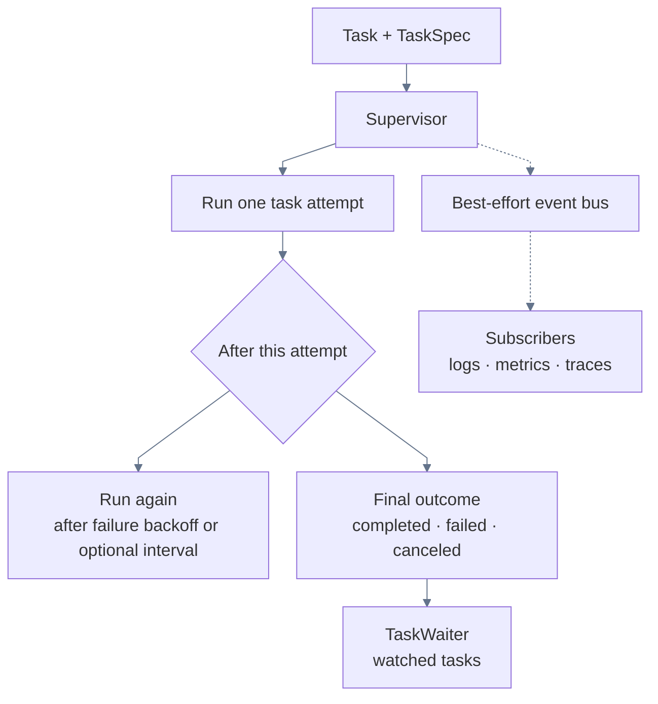

```mermaid
%%{init: {"theme": "default", "flowchart": {"curve": "linear", "htmlLabels": true, "nodeSpacing": 28, "rankSpacing": 28}, "themeVariables": {"primaryColor": "#eef2ff", "primaryTextColor": "#111827", "primaryBorderColor": "#7c3aed", "lineColor": "#64748b", "edgeLabelBackground": "#eef2ff", "secondaryColor": "#f8fafc", "tertiaryColor": "#ffffff", "fontFamily": "Arial", "fontSize": "17px"}}}%%
flowchart TB
    input["Task + TaskSpec"] --> supervisor["Supervisor"]
    supervisor --> attempt["Run one task attempt"]
    attempt --> next{"After this attempt"}

    next --> retry["Run again<br/>after failure backoff or optional interval"]

    next --> outcome["Final outcome<br/>completed · failed · canceled"]
    outcome --> waiter["TaskWaiter<br/>watched tasks"]

    supervisor -.-> bus["Best-effort event bus"]
    bus -.-> subscribers["Subscribers<br/>logs · metrics · traces"]
```
