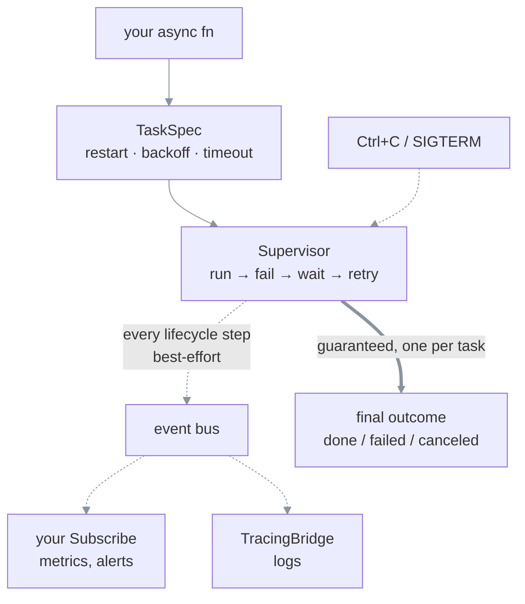

```mermaid
%%{init: {"theme": "default", "themeVariables": {"lineColor": "#8b949e", "edgeLabelBackground": "#e8e8e8"}}}%%
flowchart TD
    fn["your async fn"] --> spec["TaskSpec<br/>restart · backoff · timeout"]
    spec --> sup["Supervisor<br/>run → fail → wait → retry"]
    sig["Ctrl+C / SIGTERM"] -.-> sup

    sup -. "every lifecycle step<br/>best-effort" .-> bus["event bus"]
    bus -.-> sub["your Subscribe<br/>metrics, alerts"]
    bus -.-> tb["TracingBridge<br/>logs"]

    sup == "guaranteed, one per task" ==> out["final outcome<br/>done / failed / canceled"]
```